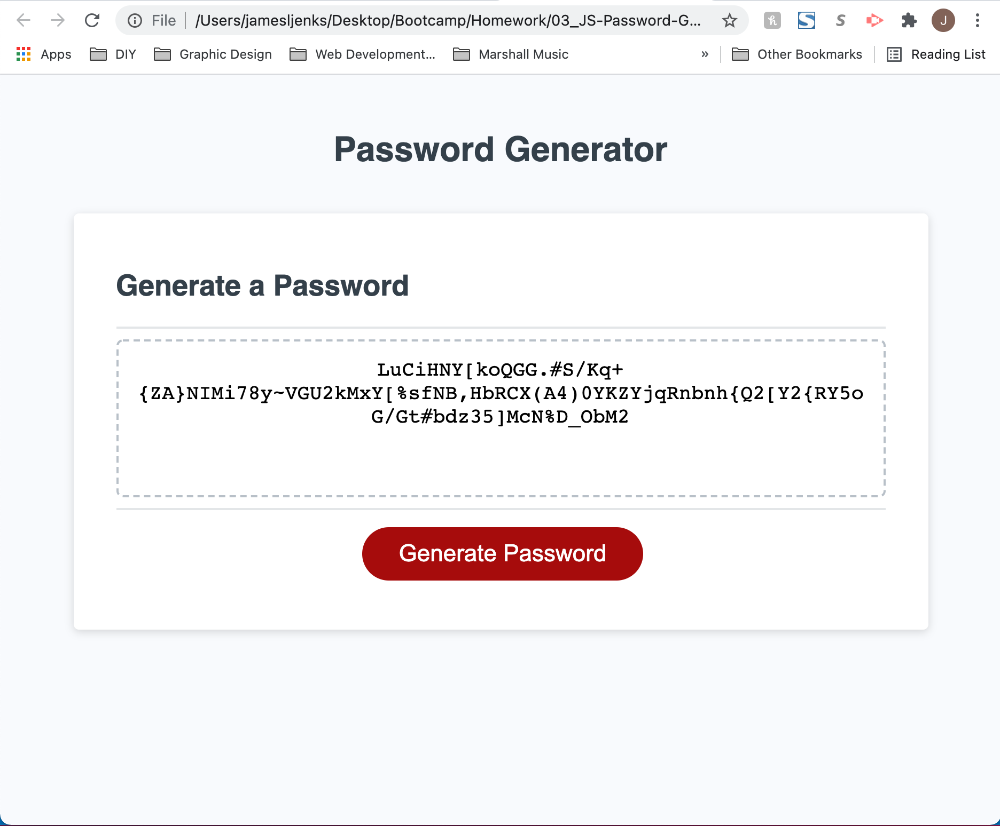

# 03_JS-Password-Generator
## Description

The goal of this project was to modify starter code to create an application that would run in the web browser and enable hypothetical employees to generate random passwords based on criteria that they select. The 

The list of password criteria to be specified included the length, as well as lowercase, uppercase, numeric, and special characters. All selections are facilitated using a series of browser window prompts. Once the user specifies all criteria, the JavaScript code generates a randomized password.

## Table of Contents

- [User Story](#user-story)
- [Acceptance Criteria](#acceptance-criteria)
- [Screenshots](#screenshots)
- [Deployed Application Link](#deployed-application-link)
- [Credits](#credits)
- [License](#license)

## User Story

```
AS AN employee with access to sensitive data
I WANT to randomly generate a password that meets certain criteria
SO THAT I can create a strong password that provides greater security
```

## Acceptance Criteria
```
GIVEN I need a new, secure password
WHEN I click the button to generate a password
THEN I am presented with a series of prompts for password criteria
WHEN prompted for password criteria
THEN I select which criteria to include in the password
WHEN prompted for the length of the password
THEN I choose a length of at least 8 characters and no more than 128 characters
WHEN prompted for character types to include in the password
THEN I choose lowercase, uppercase, numeric, and/or special characters
WHEN I answer each prompt
THEN my input should be validated and at least one character type should be selected
WHEN all prompts are answered
THEN a password is generated that matches the selected criteria
WHEN the password is generated
THEN the password is either displayed in an alert or written to the page
```

## Screenshots
These are screenshots that demonstrate the application in action:

1. The user clicks "Generate Password" and specifies a password length between 8 and 128 characters.


2. The user specifies if numeric characters should be included in the password.


3. The user specifies if uppercase characters should be included in the password.


4. The user specifies if lowercase characters should be included in the password.


5. The user specifies if special characters, or symbols, should be included in the password.


6. Based on the criteria that the user selects, a random password is generated.


## Deployed Application Link

This is a link to the deployed application: https://jamesljenks.github.io/03_JS-Password-Generator/ 
## Credits
- Trilogy Education Services
- W3 Schools: https://www.w3schools.com/
- MDN Web Docs: https://developer.mozilla.org/en-US

## License

This project was created by James L. Jenks as part of the curriculum for the MSU Coding Boot Camp and Trilogy Education Services.

© 2021 Trilogy Education Services, LLC, a 2U, Inc. brand. Confidential and Proprietary. All Rights Reserved.
    